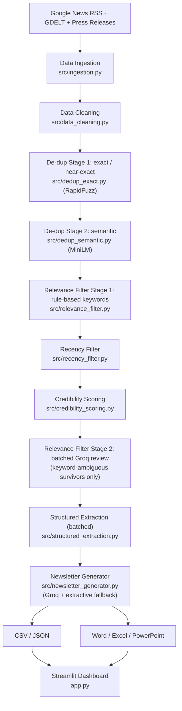

# FMCG Deal Intelligence Agent

Generates a concise FMCG industry newsletter on recent M&A, investment, and
funding activity from public news — ingesting, de-duplicating, filtering
for relevance, scoring source credibility, and drafting a business
newsletter, refreshed on a schedule so the output reflects current activity.

## Deliverables

| Deliverable | Where |
|---|---|
| Demo app link | *fill in after deploying — see [Deployment](#deployment)* |
| GitHub repo link | https://github.com/Ddeepakshi/fmcg-newsletter-agent |
| Raw data (CSV / JSON) | `data/output/deals.csv`, `data/output/deals.json` |
| Newsletter (Word / Excel / PowerPoint) | `data/output/newsletter.docx`, `data/output/deals.xlsx` (includes a **Newsletter** sheet, not just the raw table), `data/output/newsletter.pptx` |
| Architecture diagram | [below](#architecture) (Mermaid — renders natively on GitHub) |
| Pipeline explanation (de-dup + relevance logic) | [Pipeline & agent logic](#pipeline--agent-logic) |

The demo app link is still blank — the code is pushed, but the app isn't
deployed yet. See [Deployment](#deployment) for the remaining step.

## Architecture



All stages are orchestrated by `src/pipeline.py`. Every drop/exclude
decision is logged to `data/logs/*.json` for auditability (nothing is
silently discarded).

Free rule-based filters (keywords, recency, credibility) run *before*
either Groq-backed stage on purpose, and both remaining Groq stages batch
many articles into one request (`config.LLM_BATCH_SIZE`, default 40)
instead of one request per article — reviewing keyword-ambiguous articles
before recency/credibility once cost 71 individual Groq calls for 2
eventual survivors; the current order and batching bring a typical run down
to ~3 Groq calls total and well under a minute of runtime.

## Pipeline & agent logic

The "agent" is a fixed, auditable pipeline, not a free-roaming LLM loop —
each stage has one job, and the LLM is only invoked where a rule genuinely
can't decide:

1. **Ingestion** (`src/ingestion.py`) — Google News RSS across 5 focused
   queries (`config.SEARCH_QUERIES`), capped at 20 results/query. GDELT is
   best-effort: it circuit-breaks after its first failure/timeout in a run
   rather than retrying (and re-waiting on) every remaining query.
2. **Cleaning** (`src/data_cleaning.py`) — strip HTML, normalize
   whitespace/casing, standardize dates to ISO 8601, drop anything missing
   a title, URL, or date.
3. **De-duplication, 2 stages** (`src/dedup_exact.py`, `src/dedup_semantic.py`):
   - *Exact/near-exact*: identical URLs merge immediately; RapidFuzz
     fuzzy-matches normalized titles above 92/100.
   - *Semantic*: MiniLM sentence embeddings + cosine similarity catch the
     same story covered with materially different wording, above a 0.85
     threshold.
   - Tie-break either way: the higher source-tier article is kept; ties
     broken by more recent publish date. Every merge is logged to
     `data/logs/duplicates.json`, nothing is silently discarded.
4. **Relevance filtering, 2 stages, cost-aware** (`src/relevance_filter.py`):
   - *Rule-based*: accepted only if the text names an FMCG industry keyword
     **and** a deal-type keyword (acquisition/merger/investment/funding/
     stake/buyout); an exclude list (product launches, appointments,
     resignations, ad/marketing campaigns) rejects immediately regardless
     of other matches.
   - *Batched LLM*: articles matching only one keyword list are ambiguous;
     they're classified in a single batched Groq call — after recency and
     credibility have already shrunk the set — rather than one call per
     article.
5. **Recency filter** (`src/recency_filter.py`) — drops anything older than
   `RECENCY_DAYS` (default 14).
6. **Credibility scoring** (`src/credibility_scoring.py`) — a transparent
   weighted formula (below); below-threshold articles are dropped and
   logged, not silently discarded.
7. **Structured extraction** (`src/structured_extraction.py`) — a batched
   Groq JSON call converts survivors into acquirer/target/deal_type/
   deal_value/currency. An unrecognized `deal_type` or a non-positive/
   non-finite `deal_value` is rejected (nulled) before saving.
8. **Newsletter generation** (`src/newsletter_generator.py`) — Groq drafts
   the newsletter from the structured records (never raw headlines); falls
   back to a template-based top-N-by-credibility extract if Groq is
   unavailable, so the demo never returns an empty or broken newsletter.

## Assumptions (stated explicitly, not buried in code)

- **Geography**: India + Global, tagged per article (`region` field) but
  not filtered — adjustable via `config.INDIA_KEYWORDS`.
- **Language**: English-language sources only.
- **"Deal" scope**: M&A, majority/minority investment, funding rounds,
  strategic stakes, buyouts. Explicitly excludes product launches,
  marketing/ad campaigns, and leadership changes.
- **Recency window** (14 days) and **semantic-dedup threshold** (0.85) were
  set empirically after spot-checking real runs, not derived from a
  universal rule — both are single constants in `config.py`. Note: real
  MiniLM cosine similarity for two differently-worded articles about the
  same deal tends to land around ~0.73, below the 0.85 threshold — this
  stage is deliberately conservative (near-verbatim republication), while
  the RapidFuzz stage is what catches most same-wording near-duplicates.
- **Credibility source tiers** are a starter, extendable list
  (`config.SOURCE_TIERS`) — not an exhaustive publisher database.

## Tech stack

| Component | Technology |
|---|---|
| Frontend / Demo | Streamlit |
| LLM | Groq API (fast + strong model tiers, both free-tier) |
| News sources | Google News RSS (primary), GDELT Doc API (best-effort, circuit-broken), optional press-release RSS feeds |
| Near-duplicate detection | RapidFuzz (exact/fuzzy) + Sentence-Transformers `all-MiniLM-L6-v2` (semantic) |
| Data processing | Pandas |
| Storage | CSV / JSON, cached "last known good" snapshot |
| Scheduling | GitHub Actions cron (`.github/workflows/refresh.yml`) + in-app "Refresh Now" |
| Output docs | python-docx, openpyxl, python-pptx |

## Setup

```bash
python3 -m venv .venv
source .venv/bin/activate
pip install -r requirements.txt

cp .env.example .env
# edit .env and set GROQ_API_KEY
```

Run the pipeline directly:

```bash
python -m src.pipeline
```

Run the dashboard:

```bash
streamlit run app.py
```

Run tests:

```bash
pytest tests/ -v
```

There's one pytest file per source module (`tests/test_<module>.py`).
Pure-logic tests (cleaning, dedup, recency, credibility, config, schema)
run unconditionally; tests that hit real network/Groq skip cleanly via
`tests/conditions.py` when no network or `GROQ_API_KEY` is available.

Each stage module is also independently runnable for manual smoke-testing,
e.g. `python -m src.ingestion`, `python -m src.dedup_exact`,
`python -m src.credibility_scoring`.

## Configuration

All tunables live in `config.py` (recency window, dedup thresholds,
credibility formula weights/threshold, source tier lists, FMCG keyword
lists, search queries, LLM batch size). Secrets (`GROQ_API_KEY`) are read
from environment variables / `.env` — never hardcoded, never committed.

## Data schema

Each record in the CSV/JSON output has: `title`, `snippet`, `source`,
`source_tier`, `published_date`, `url`, `region`, `is_duplicate_of`,
`credibility_score`, `acquirer`, `target`, `deal_type`, `deal_value`,
`currency`, `relevance_flag`. See `src/schema.py`.

## Credibility formula

```
credibility_score =
    0.35 * source_tier_weight     (Tier1=1.0, Tier2=0.6, Tier3=0.3)
  + 0.20 * has_company_names      (1 if >=2 named entities detected, else 0)
  + 0.20 * has_deal_value         (1 if a monetary figure is present, else 0)
  + 0.15 * recency_weight         (1.0 if <=3 days old, 0.6 if <=7 days, else 0.2)
  + 0.10 * completeness           (1 if title+snippet+date all present, else 0)
```

Articles scoring below `CREDIBILITY_THRESHOLD` (default 0.5) are dropped and
logged to `data/logs/excluded_low_credibility.json`.

`has_company_names` and `has_deal_value` are computed with lightweight regex
heuristics (not a full NER model) since scoring runs before the LLM
extraction stage — see `src/credibility_scoring.py` for the exact logic.

## Guardrails

Multiple validation layers run before (and after) any Groq call, so a
single LLM response never singlehandedly decides what ships in the
newsletter:

**Data guardrails** (`src/data_cleaning.py`, `src/dedup_exact.py`,
`src/dedup_semantic.py`, `src/recency_filter.py`) — drop empty articles
(missing title/URL/date), remove duplicate URLs, remove near-duplicate
titles (RapidFuzz), remove semantic duplicates (MiniLM cosine similarity),
and ignore anything older than `RECENCY_DAYS`.

**Business guardrails** (`src/relevance_filter.py`, `config.py`) — an
article is only accepted if it names an FMCG industry keyword *and* a deal
type (acquisition/merger/investment/funding/stake/buyout); `EXCLUDE_KEYWORDS`
rejects product launches, appointments, resignations, and ad/marketing
campaigns before any other check runs.

**LLM guardrails** (`src/llm_client.py`, `src/structured_extraction.py`) —
strict prompts with an explicit output schema, JSON mode
(`response_format={"type": "json_object"}`) for every classification/
extraction call, temperature `0.0` for those calls (only the newsletter
draft uses `0.3`, since that's prose, not extraction), and a fresh retry
(`_chat_json` in `llm_client.py`) if a response isn't valid JSON or doesn't
match the requested shape — distinct from `_chat`'s own retry for
network/API failures. Extracted fields are validated before being saved:
an unrecognized `deal_type` is rejected (nulled) rather than passed through
as whatever string the model produced, and `deal_value` is rejected unless
it's a positive, finite number.

## Compliance

Only title, snippet, source name, and URL are stored/redistributed — never
full article bodies — per publisher terms of service. Every record and
newsletter entry links back to its original source.

## Demo resilience

- All external calls (news fetch + Groq) retry with exponential backoff.
- Every successful pipeline run overwrites `data/cache/last_known_good.json`,
  which ships with the repo so the dashboard always has something to show.
- If Groq is unavailable: ambiguous relevance calls fail open (kept, flagged
  `Ambiguous-LLM-Unavailable`), extraction leaves deal fields empty, and the
  newsletter falls back to an extractive top-N-by-credibility template.

## Deployment

- [x] Pushed to GitHub: https://github.com/Ddeepakshi/fmcg-newsletter-agent
- [ ] Add `GROQ_API_KEY` as a repository secret (enables `.github/workflows/refresh.yml`).
- [ ] Deploy `app.py` on Streamlit Community Cloud (or Vercel, per the brief),
      adding `GROQ_API_KEY` under the app's secrets manager → that URL is the
      **demo app link** deliverable.
